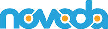
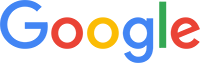

# Kazak

**Kazak** is a next-gen tech conference schedule platform created by members of the community. The project is made of two main parts, an **Android app** and a **cloud backend**.

Issue tracker: [youtrack.kazak.io](http://youtrack.kazak.io/issues)

## Core team IS AWESUM

[Benjamin Augustin](http://github.com/Dorvaryn)

[Daniele Bonaldo](http://github.com/danybony)

[Leonie Brewin](http://github.com/leoniebrewin)

[Dave Clements](http://github.com/DigitalPencils)

[Eugenio Marletti](http://github.com/Takhion)

[Sebastiano Poggi](http://github.com/rock3r)

[Francesco Pontillo](http://github.com/frapontillo)

## Licence

Kazak is licenced under the MIT licence, unless explicitly stated.

	The MIT License (MIT)

	Copyright (c) 2015 The Kazak Contributors

	Permission is hereby granted, free of charge, to any person obtaining a copy
	of this software and associated documentation files (the "Software"), to deal
	in the Software without restriction, including without limitation the rights
	to use, copy, modify, merge, publish, distribute, sublicense, and/or sell
	copies of the Software, and to permit persons to whom the Software is
	furnished to do so, subject to the following conditions:

	The above copyright notice and this permission notice shall be included in
	all copies or substantial portions of the Software.

	THE SOFTWARE IS PROVIDED "AS IS", WITHOUT WARRANTY OF ANY KIND, EXPRESS OR
	IMPLIED, INCLUDING BUT NOT LIMITED TO THE WARRANTIES OF MERCHANTABILITY,
	FITNESS FOR A PARTICULAR PURPOSE AND NONINFRINGEMENT. IN NO EVENT SHALL THE
	AUTHORS OR COPYRIGHT HOLDERS BE LIABLE FOR ANY CLAIM, DAMAGES OR OTHER
	LIABILITY, WHETHER IN AN ACTION OF CONTRACT, TORT OR OTHERWISE, ARISING FROM,
	OUT OF OR IN CONNECTION WITH THE SOFTWARE OR THE USE OR OTHER DEALINGS IN
	THE SOFTWARE.

Contributions from Facebook employees are licenced under the terms specified in the
[`FB-LICENSE`](FB-LICENSE) file.

## Thanks to

This app couldn't exist without the awesome work of its core team of contributors and everybody that has helped the project.

We want to thank the following companies for contributing to the development by providing access to their technologies and
resources:

